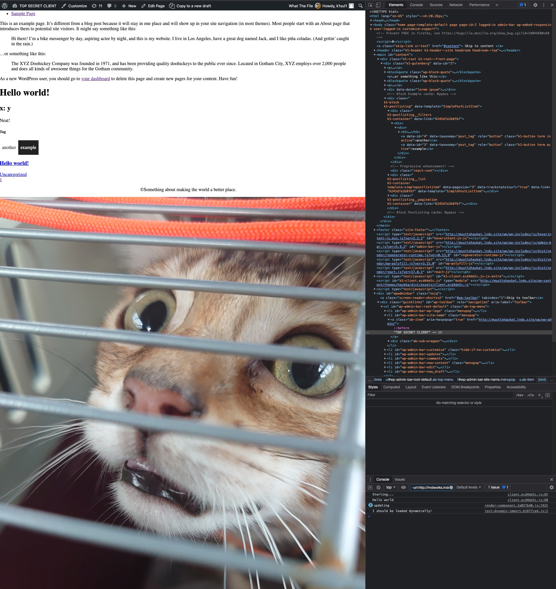

# Pretty much blank WordPress theme base, built w/ Vite

Vite is a webpack alternative. It doesn't have all the features but it's faster and nicer to use.

https://vitejs.dev/

This theme is "loosely" based on [wordpress-theme-base](https://github.com/k1sul1/wordpress-theme-base).

## Requirements

- PHP 7.4 or higher
- NodeJS, use the current LTS for optimal results.
- ACF Pro, for Gutenberg blocks w/ ACF
- https://github.com/aucor/wp_query-route-to-rest-api, for PostListing block
- [k1sul1/k1kit](https://github.com/k1sul1/k1kit), for sharing code between projects

## Getting started

Clone the repo into your theme directory, `npm install` and `npm run dev`.

It should just work. This is what it should look like after you've added the two example components on the Sample Page, assuming a fresh installation.



It's very barebones. Very. Add in whatever you want, nothing should get in the way.

However, if you end up using this repository as a template for your own work, **read the documentation of k1kit**, esp. about the parts that you might not want.

In reality, I'd suggest that you just take the relevant parts from these files:

- classes/class.vite.php
- header.php
- functions.php
- vite.config.ts

The header contents are crucial for Vite to work properly.

## Features

Everything from [k1sul1/k1kit](https://github.com/k1sul1/k1kit) and a few cherries on top. See it for more detailed description.

- Custom Gutenberg block toolkit.
- Multilinguality support using Polylang, falling back to Core
- Reusable & combinable data-driven templates
  - Yes, they can get ugly. So is PHP.
- Asset filename hashing for cache busting
- Hot module reloading (HMR) for CSS & _compatible_ JS
- React support
- CSS preprocessor support
  - I prefer Stylus, if you want to use SCSS, that's easy. Install `node-sass` with npm.
- `<title>` is prefixed with the current environment to avoid confusion when working with multiple instances
- Namespaces (believe it or not, these are rare in the WordPress world)

## Setup

Edit `config.json` to match your WordPress setup. Arguably not very hard. Run `npm install`.

To run webpack-dev-server (WDS), run `npm run dev`. If you want to separate the build processes for admin and frontend, use `npm run dev:client` and `npm run dev:admin` instead. The advantage of that is that build errors do not get buried.

To create a production build, run `npm run build`.

In webpack-dev-server, CSS should update automatically without reloading, as should any module.hot compatible code. React should work out of the box.

It is not possible to use the admin through the WDS proxy due to CORS reasons. Things like the editor will not work. So make a habit of ensuring you're using the admin directly and not through the WDS that runs in the background.

**Remember to look a the README files buried in other folders of the theme! They might help!**

## Issues?

Always.

### Things don't look 100% right in the admin editor!

Let me tell you a story. You are building a complex & fragile, but beautiful thing. You make sure it works in all the ways it could be used by the users. Then someone runs over it with a truck.

That's what WordPress did and is doing. It bleeds styles and HTML into the editor, making our HTML not our HTML anymore, and our CSS unrealiable. It breaks colours, backgrounds and spacings.

Unsetting all core styles or recreating our styles so they work inside the editor which bleeds styles into the elements we create is not viable. It works well enough most of the time.
The content can be edited, and a working preview of the page being edited can be viewed by using the Preview link in the editor itself.

## Self-Help section

### Block creation

Create a file to blocks/. Name it whatever you want, just capitalize the first letter.

```php
<?php
// blocks/Example.php
namespace k1\Blocks;

class Example extends \k1\Block {
  public function render($data = []) { ?>
    <div class="example-block">
      <?=get_field('example')?>
    </div>
  <?php
  }

  /*
   * If you need to change the settings, that's easy.
   * If you don't, don't define this function.
   */
  public function getSettings() {
    $data = parent::getSettings();
    $data['mode'] = 'preview';

    return $data;
  }
}
```

Then just add a new field group, like you normally would. Just select your block as the location.

### Can I call the custom blocks manually?

Yes. This example showcases how you can also cache those manually called blocks.

```php
<?php
namespace k1;

$app = app();
$hero = $app->getBlock('Hero');

echo withTransient(capture([$hero, 'render'], [
  'content' => [
    'data' => '<h1>' . title($title) . '</h1>',
    'position' => 'centerBottom',
  ],
  'background' => [
    'backgroundMedia' => [
      'type' => 'image',
      'image' => [
        'data' => $thumb,
        'imagePosition' => 'centerCenter'
      ]
    ]
  ]
]), [
  'key' => 'indexHero',
  'options' => [
    'type' => 'manual-block',
    'expiry' => \HOUR_IN_SECONDS,
  ]
], $missReason);

echo "\n\n\n<!-- Block " . $hero->getName() . " cache: " . transientResult($missReason) . " -->";
```

When calling manually, you have to make sure that you use the same datastructure as ACF.
